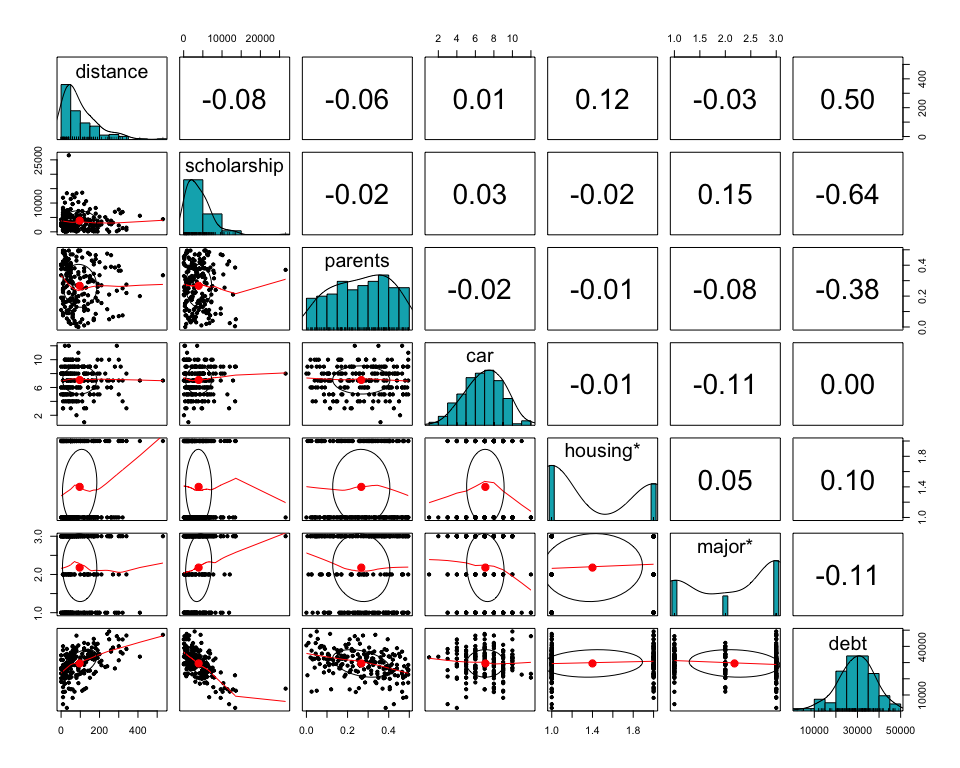
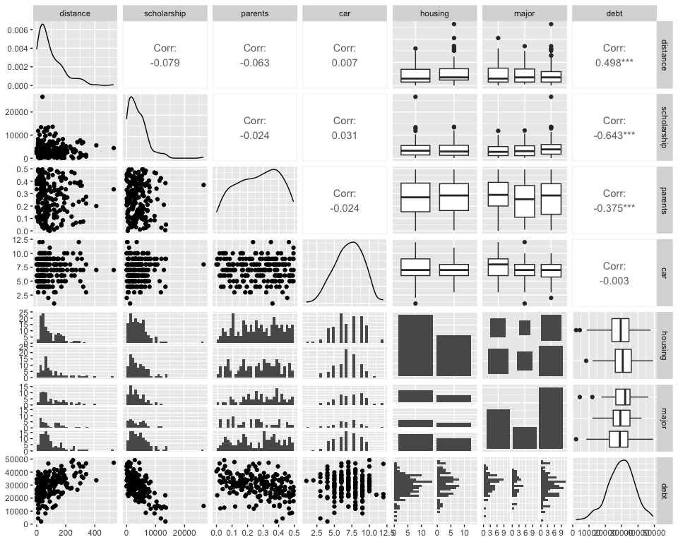
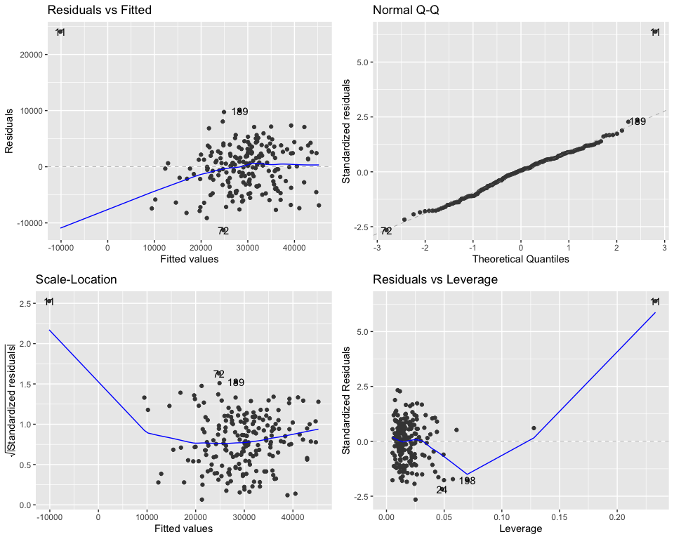
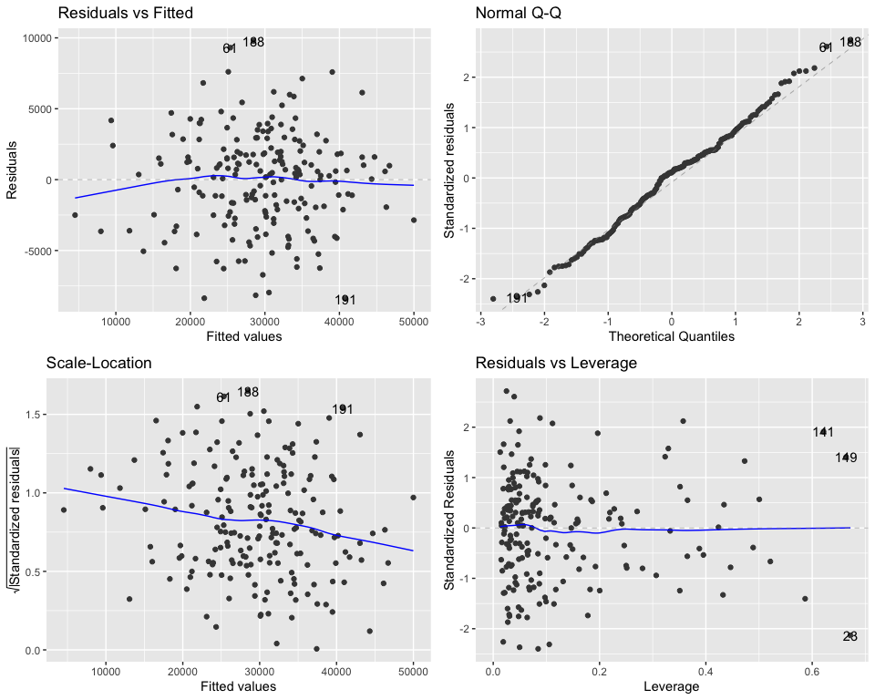

Activity 5 - Mini-competition Explorations
================

``` r
library("knitr")
library("kableExtra")
library("tidyverse")
library("tidymodels")
library("GGally")
library("psych")
library("ggfortify")
```

## Import Data

``` r
allendale_students <- readr::read_csv("./data/allendale-students.csv")

knitr::kable(head(allendale_students))
```

<table>
<thead>
<tr>
<th style="text-align:right;">
distance
</th>
<th style="text-align:right;">
scholarship
</th>
<th style="text-align:right;">
parents
</th>
<th style="text-align:right;">
car
</th>
<th style="text-align:left;">
housing
</th>
<th style="text-align:left;">
major
</th>
<th style="text-align:right;">
debt
</th>
</tr>
</thead>
<tbody>
<tr>
<td style="text-align:right;">
40
</td>
<td style="text-align:right;">
1532
</td>
<td style="text-align:right;">
0.440
</td>
<td style="text-align:right;">
6
</td>
<td style="text-align:left;">
off campus
</td>
<td style="text-align:left;">
STEM
</td>
<td style="text-align:right;">
26389
</td>
</tr>
<tr>
<td style="text-align:right;">
30
</td>
<td style="text-align:right;">
7479
</td>
<td style="text-align:right;">
0.265
</td>
<td style="text-align:right;">
7
</td>
<td style="text-align:left;">
on campus
</td>
<td style="text-align:left;">
STEM
</td>
<td style="text-align:right;">
21268
</td>
</tr>
<tr>
<td style="text-align:right;">
130
</td>
<td style="text-align:right;">
2664
</td>
<td style="text-align:right;">
0.115
</td>
<td style="text-align:right;">
3
</td>
<td style="text-align:left;">
on campus
</td>
<td style="text-align:left;">
business
</td>
<td style="text-align:right;">
32312
</td>
</tr>
<tr>
<td style="text-align:right;">
120
</td>
<td style="text-align:right;">
1998
</td>
<td style="text-align:right;">
0.325
</td>
<td style="text-align:right;">
9
</td>
<td style="text-align:left;">
on campus
</td>
<td style="text-align:left;">
business
</td>
<td style="text-align:right;">
28539
</td>
</tr>
<tr>
<td style="text-align:right;">
30
</td>
<td style="text-align:right;">
1462
</td>
<td style="text-align:right;">
0.105
</td>
<td style="text-align:right;">
10
</td>
<td style="text-align:left;">
off campus
</td>
<td style="text-align:left;">
other
</td>
<td style="text-align:right;">
34867
</td>
</tr>
<tr>
<td style="text-align:right;">
0
</td>
<td style="text-align:right;">
3053
</td>
<td style="text-align:right;">
0.335
</td>
<td style="text-align:right;">
9
</td>
<td style="text-align:left;">
off campus
</td>
<td style="text-align:left;">
STEM
</td>
<td style="text-align:right;">
18193
</td>
</tr>
</tbody>
</table>

## Initial Analysis

``` r
kable(summary(allendale_students))
```

<table>
<thead>
<tr>
<th style="text-align:left;">
</th>
<th style="text-align:left;">
distance
</th>
<th style="text-align:left;">
scholarship
</th>
<th style="text-align:left;">
parents
</th>
<th style="text-align:left;">
car
</th>
<th style="text-align:left;">
housing
</th>
<th style="text-align:left;">
major
</th>
<th style="text-align:left;">
debt
</th>
</tr>
</thead>
<tbody>
<tr>
<td style="text-align:left;">
</td>
<td style="text-align:left;">
Min. : 0.00
</td>
<td style="text-align:left;">
Min. : 25
</td>
<td style="text-align:left;">
Min. :0.0000
</td>
<td style="text-align:left;">
Min. : 1.00
</td>
<td style="text-align:left;">
Length:200
</td>
<td style="text-align:left;">
Length:200
</td>
<td style="text-align:left;">
Min. : 2019
</td>
</tr>
<tr>
<td style="text-align:left;">
</td>
<td style="text-align:left;">
1st Qu.: 30.00
</td>
<td style="text-align:left;">
1st Qu.: 1312
</td>
<td style="text-align:left;">
1st Qu.:0.1588
</td>
<td style="text-align:left;">
1st Qu.: 6.00
</td>
<td style="text-align:left;">
Class :character
</td>
<td style="text-align:left;">
Class :character
</td>
<td style="text-align:left;">
1st Qu.:24231
</td>
</tr>
<tr>
<td style="text-align:left;">
</td>
<td style="text-align:left;">
Median : 70.00
</td>
<td style="text-align:left;">
Median : 3202
</td>
<td style="text-align:left;">
Median :0.2800
</td>
<td style="text-align:left;">
Median : 7.00
</td>
<td style="text-align:left;">
Mode :character
</td>
<td style="text-align:left;">
Mode :character
</td>
<td style="text-align:left;">
Median :29827
</td>
</tr>
<tr>
<td style="text-align:left;">
</td>
<td style="text-align:left;">
Mean : 96.55
</td>
<td style="text-align:left;">
Mean : 3899
</td>
<td style="text-align:left;">
Mean :0.2666
</td>
<td style="text-align:left;">
Mean : 7.08
</td>
<td style="text-align:left;">
NA
</td>
<td style="text-align:left;">
NA
</td>
<td style="text-align:left;">
Mean :29473
</td>
</tr>
<tr>
<td style="text-align:left;">
</td>
<td style="text-align:left;">
3rd Qu.:140.00
</td>
<td style="text-align:left;">
3rd Qu.: 5504
</td>
<td style="text-align:left;">
3rd Qu.:0.3812
</td>
<td style="text-align:left;">
3rd Qu.: 9.00
</td>
<td style="text-align:left;">
NA
</td>
<td style="text-align:left;">
NA
</td>
<td style="text-align:left;">
3rd Qu.:35022
</td>
</tr>
<tr>
<td style="text-align:left;">
</td>
<td style="text-align:left;">
Max. :530.00
</td>
<td style="text-align:left;">
Max. :26574
</td>
<td style="text-align:left;">
Max. :0.4950
</td>
<td style="text-align:left;">
Max. :12.00
</td>
<td style="text-align:left;">
NA
</td>
<td style="text-align:left;">
NA
</td>
<td style="text-align:left;">
Max. :49196
</td>
</tr>
</tbody>
</table>

``` r
psych::pairs.panels(
  allendale_students,
  hist.col = "#00AFBB",
  method= "pearson",
  density = TRUE,
  ellipses = TRUE
)
```

<!-- -->

``` r
allendale_students %>%
  ggpairs()
```

<!-- -->

From the above visualization, we can observe that the observations in
distance and scholarship variables are skewed towards right. Also, we
can observe that the variable debt has some correlation with distance,
scholarship and parents variables.

## Perform Single Linear Regression

Lets use the `lm` function to fit the linear model where `y` is debt and
`x` is distance, scholarship, parents, car, and housing

### SLR: debt and distance

``` r
m_distance <- lm(debt ~ distance, data = allendale_students)
tidy(m_distance) %>% kable()
```

<table>
<thead>
<tr>
<th style="text-align:left;">
term
</th>
<th style="text-align:right;">
estimate
</th>
<th style="text-align:right;">
std.error
</th>
<th style="text-align:right;">
statistic
</th>
<th style="text-align:right;">
p.value
</th>
</tr>
</thead>
<tbody>
<tr>
<td style="text-align:left;">
(Intercept)
</td>
<td style="text-align:right;">
24910.73423
</td>
<td style="text-align:right;">
768.492674
</td>
<td style="text-align:right;">
32.415058
</td>
<td style="text-align:right;">
0
</td>
</tr>
<tr>
<td style="text-align:left;">
distance
</td>
<td style="text-align:right;">
47.25003
</td>
<td style="text-align:right;">
5.845699
</td>
<td style="text-align:right;">
8.082871
</td>
<td style="text-align:right;">
0
</td>
</tr>
</tbody>
</table>

``` r
glance(m_distance) %>% kable()
```

<table>
<thead>
<tr>
<th style="text-align:right;">
r.squared
</th>
<th style="text-align:right;">
adj.r.squared
</th>
<th style="text-align:right;">
sigma
</th>
<th style="text-align:right;">
statistic
</th>
<th style="text-align:right;">
p.value
</th>
<th style="text-align:right;">
df
</th>
<th style="text-align:right;">
logLik
</th>
<th style="text-align:right;">
AIC
</th>
<th style="text-align:right;">
BIC
</th>
<th style="text-align:right;">
deviance
</th>
<th style="text-align:right;">
df.residual
</th>
<th style="text-align:right;">
nobs
</th>
</tr>
</thead>
<tbody>
<tr>
<td style="text-align:right;">
0.2480998
</td>
<td style="text-align:right;">
0.2443023
</td>
<td style="text-align:right;">
7376.057
</td>
<td style="text-align:right;">
65.33281
</td>
<td style="text-align:right;">
0
</td>
<td style="text-align:right;">
1
</td>
<td style="text-align:right;">
-2063.982
</td>
<td style="text-align:right;">
4133.963
</td>
<td style="text-align:right;">
4143.858
</td>
<td style="text-align:right;">
10772431725
</td>
<td style="text-align:right;">
198
</td>
<td style="text-align:right;">
200
</td>
</tr>
</tbody>
</table>

### SLR: debt and scholarship

``` r
m_scholarship <- lm(debt ~ scholarship, data = allendale_students)
tidy(m_scholarship) %>% kable()
```

<table>
<thead>
<tr>
<th style="text-align:left;">
term
</th>
<th style="text-align:right;">
estimate
</th>
<th style="text-align:right;">
std.error
</th>
<th style="text-align:right;">
statistic
</th>
<th style="text-align:right;">
p.value
</th>
</tr>
</thead>
<tbody>
<tr>
<td style="text-align:left;">
(Intercept)
</td>
<td style="text-align:right;">
35735.773269
</td>
<td style="text-align:right;">
702.3780382
</td>
<td style="text-align:right;">
50.87826
</td>
<td style="text-align:right;">
0
</td>
</tr>
<tr>
<td style="text-align:left;">
scholarship
</td>
<td style="text-align:right;">
-1.606293
</td>
<td style="text-align:right;">
0.1359803
</td>
<td style="text-align:right;">
-11.81268
</td>
<td style="text-align:right;">
0
</td>
</tr>
</tbody>
</table>

``` r
glance(m_scholarship) %>% kable()
```

<table>
<thead>
<tr>
<th style="text-align:right;">
r.squared
</th>
<th style="text-align:right;">
adj.r.squared
</th>
<th style="text-align:right;">
sigma
</th>
<th style="text-align:right;">
statistic
</th>
<th style="text-align:right;">
p.value
</th>
<th style="text-align:right;">
df
</th>
<th style="text-align:right;">
logLik
</th>
<th style="text-align:right;">
AIC
</th>
<th style="text-align:right;">
BIC
</th>
<th style="text-align:right;">
deviance
</th>
<th style="text-align:right;">
df.residual
</th>
<th style="text-align:right;">
nobs
</th>
</tr>
</thead>
<tbody>
<tr>
<td style="text-align:right;">
0.413402
</td>
<td style="text-align:right;">
0.4104394
</td>
<td style="text-align:right;">
6515.001
</td>
<td style="text-align:right;">
139.5395
</td>
<td style="text-align:right;">
0
</td>
<td style="text-align:right;">
1
</td>
<td style="text-align:right;">
-2039.155
</td>
<td style="text-align:right;">
4084.31
</td>
<td style="text-align:right;">
4094.205
</td>
<td style="text-align:right;">
8404156299
</td>
<td style="text-align:right;">
198
</td>
<td style="text-align:right;">
200
</td>
</tr>
</tbody>
</table>

### SLR: debt and parents

``` r
m_parents <- lm(debt ~ parents, data = allendale_students)
tidy(m_parents) %>% kable()
```

<table>
<thead>
<tr>
<th style="text-align:left;">
term
</th>
<th style="text-align:right;">
estimate
</th>
<th style="text-align:right;">
std.error
</th>
<th style="text-align:right;">
statistic
</th>
<th style="text-align:right;">
p.value
</th>
</tr>
</thead>
<tbody>
<tr>
<td style="text-align:left;">
(Intercept)
</td>
<td style="text-align:right;">
35587.43
</td>
<td style="text-align:right;">
1208.988
</td>
<td style="text-align:right;">
29.435710
</td>
<td style="text-align:right;">
0
</td>
</tr>
<tr>
<td style="text-align:left;">
parents
</td>
<td style="text-align:right;">
-22931.59
</td>
<td style="text-align:right;">
4023.178
</td>
<td style="text-align:right;">
-5.699869
</td>
<td style="text-align:right;">
0
</td>
</tr>
</tbody>
</table>

``` r
glance(m_parents) %>% kable()
```

<table>
<thead>
<tr>
<th style="text-align:right;">
r.squared
</th>
<th style="text-align:right;">
adj.r.squared
</th>
<th style="text-align:right;">
sigma
</th>
<th style="text-align:right;">
statistic
</th>
<th style="text-align:right;">
p.value
</th>
<th style="text-align:right;">
df
</th>
<th style="text-align:right;">
logLik
</th>
<th style="text-align:right;">
AIC
</th>
<th style="text-align:right;">
BIC
</th>
<th style="text-align:right;">
deviance
</th>
<th style="text-align:right;">
df.residual
</th>
<th style="text-align:right;">
nobs
</th>
</tr>
</thead>
<tbody>
<tr>
<td style="text-align:right;">
0.140955
</td>
<td style="text-align:right;">
0.1366164
</td>
<td style="text-align:right;">
7884.1
</td>
<td style="text-align:right;">
32.48851
</td>
<td style="text-align:right;">
0
</td>
<td style="text-align:right;">
1
</td>
<td style="text-align:right;">
-2077.303
</td>
<td style="text-align:right;">
4160.607
</td>
<td style="text-align:right;">
4170.502
</td>
<td style="text-align:right;">
12307488978
</td>
<td style="text-align:right;">
198
</td>
<td style="text-align:right;">
200
</td>
</tr>
</tbody>
</table>

### SLR: debt and car

``` r
m_car <- lm(debt ~ car, data = allendale_students)
tidy(m_car) %>% kable()
```

<table>
<thead>
<tr>
<th style="text-align:left;">
term
</th>
<th style="text-align:right;">
estimate
</th>
<th style="text-align:right;">
std.error
</th>
<th style="text-align:right;">
statistic
</th>
<th style="text-align:right;">
p.value
</th>
</tr>
</thead>
<tbody>
<tr>
<td style="text-align:left;">
(Intercept)
</td>
<td style="text-align:right;">
29553.70566
</td>
<td style="text-align:right;">
2191.521
</td>
<td style="text-align:right;">
13.4854760
</td>
<td style="text-align:right;">
0.0000000
</td>
</tr>
<tr>
<td style="text-align:left;">
car
</td>
<td style="text-align:right;">
-11.43795
</td>
<td style="text-align:right;">
297.650
</td>
<td style="text-align:right;">
-0.0384275
</td>
<td style="text-align:right;">
0.9693856
</td>
</tr>
</tbody>
</table>

``` r
glance(m_car) %>% kable()
```

<table>
<thead>
<tr>
<th style="text-align:right;">
r.squared
</th>
<th style="text-align:right;">
adj.r.squared
</th>
<th style="text-align:right;">
sigma
</th>
<th style="text-align:right;">
statistic
</th>
<th style="text-align:right;">
p.value
</th>
<th style="text-align:right;">
df
</th>
<th style="text-align:right;">
logLik
</th>
<th style="text-align:right;">
AIC
</th>
<th style="text-align:right;">
BIC
</th>
<th style="text-align:right;">
deviance
</th>
<th style="text-align:right;">
df.residual
</th>
<th style="text-align:right;">
nobs
</th>
</tr>
</thead>
<tbody>
<tr>
<td style="text-align:right;">
7.5e-06
</td>
<td style="text-align:right;">
-0.005043
</td>
<td style="text-align:right;">
8506.336
</td>
<td style="text-align:right;">
0.0014767
</td>
<td style="text-align:right;">
0.9693856
</td>
<td style="text-align:right;">
1
</td>
<td style="text-align:right;">
-2092.496
</td>
<td style="text-align:right;">
4190.992
</td>
<td style="text-align:right;">
4200.887
</td>
<td style="text-align:right;">
14326836259
</td>
<td style="text-align:right;">
198
</td>
<td style="text-align:right;">
200
</td>
</tr>
</tbody>
</table>

## Multiple Linear Regression

Fit the multiple linear regression with debt as dependent variables and
distance, scholarship and parents as independent variables.

``` r
m_mlr_dsp <- lm(debt ~ distance + scholarship + parents , data = allendale_students)
tidy(m_mlr_dsp) %>% kable()
```

<table>
<thead>
<tr>
<th style="text-align:left;">
term
</th>
<th style="text-align:right;">
estimate
</th>
<th style="text-align:right;">
std.error
</th>
<th style="text-align:right;">
statistic
</th>
<th style="text-align:right;">
p.value
</th>
</tr>
</thead>
<tbody>
<tr>
<td style="text-align:left;">
(Intercept)
</td>
<td style="text-align:right;">
37510.151327
</td>
<td style="text-align:right;">
852.1851796
</td>
<td style="text-align:right;">
44.01643
</td>
<td style="text-align:right;">
0
</td>
</tr>
<tr>
<td style="text-align:left;">
distance
</td>
<td style="text-align:right;">
40.480992
</td>
<td style="text-align:right;">
3.4285774
</td>
<td style="text-align:right;">
11.80694
</td>
<td style="text-align:right;">
0
</td>
</tr>
<tr>
<td style="text-align:left;">
scholarship
</td>
<td style="text-align:right;">
-1.544496
</td>
<td style="text-align:right;">
0.0901445
</td>
<td style="text-align:right;">
-17.13356
</td>
<td style="text-align:right;">
0
</td>
</tr>
<tr>
<td style="text-align:left;">
parents
</td>
<td style="text-align:right;">
-22215.518409
</td>
<td style="text-align:right;">
2201.4066083
</td>
<td style="text-align:right;">
-10.09151
</td>
<td style="text-align:right;">
0
</td>
</tr>
</tbody>
</table>

Access model fit using `glance`:

``` r
glance(m_mlr_dsp) %>% kable()
```

<table>
<thead>
<tr>
<th style="text-align:right;">
r.squared
</th>
<th style="text-align:right;">
adj.r.squared
</th>
<th style="text-align:right;">
sigma
</th>
<th style="text-align:right;">
statistic
</th>
<th style="text-align:right;">
p.value
</th>
<th style="text-align:right;">
df
</th>
<th style="text-align:right;">
logLik
</th>
<th style="text-align:right;">
AIC
</th>
<th style="text-align:right;">
BIC
</th>
<th style="text-align:right;">
deviance
</th>
<th style="text-align:right;">
df.residual
</th>
<th style="text-align:right;">
nobs
</th>
</tr>
</thead>
<tbody>
<tr>
<td style="text-align:right;">
0.7466082
</td>
<td style="text-align:right;">
0.7427297
</td>
<td style="text-align:right;">
4303.73
</td>
<td style="text-align:right;">
192.5019
</td>
<td style="text-align:right;">
0
</td>
<td style="text-align:right;">
3
</td>
<td style="text-align:right;">
-1955.215
</td>
<td style="text-align:right;">
3920.43
</td>
<td style="text-align:right;">
3936.921
</td>
<td style="text-align:right;">
3630330014
</td>
<td style="text-align:right;">
196
</td>
<td style="text-align:right;">
200
</td>
</tr>
</tbody>
</table>

Now, lets access the model diagnostics using the `ggplot2::autoplot`
function.

``` r
ggplot2::autoplot(m_mlr_dsp)
```

<!-- -->

In the above diagnostics plot, we can observe that observation 11 is
clearly an outlier. Lets use `broom::augment` to further analyze the
outlier.

``` r
# https://broom.tidymodels.org/reference/augment.lm.html
augment_allendale_students <- broom::augment(m_mlr_dsp, data=allendale_students)
```

Looking into `augment_allendale_students` variable, it looks like
observation `11` is clearly an outlier. lets remove it from the data:

``` r
data <- allendale_students %>%
  filter(!row_number() %in% c(11))
```

Now, lets fit the multiple linear regression again:

``` r
m_mlr_dsp <- lm(debt ~ distance + scholarship + parents , data = data)
tidy(m_mlr_dsp) %>% kable()
```

<table>
<thead>
<tr>
<th style="text-align:left;">
term
</th>
<th style="text-align:right;">
estimate
</th>
<th style="text-align:right;">
std.error
</th>
<th style="text-align:right;">
statistic
</th>
<th style="text-align:right;">
p.value
</th>
</tr>
</thead>
<tbody>
<tr>
<td style="text-align:left;">
(Intercept)
</td>
<td style="text-align:right;">
38830.301126
</td>
<td style="text-align:right;">
782.338344
</td>
<td style="text-align:right;">
49.63364
</td>
<td style="text-align:right;">
0
</td>
</tr>
<tr>
<td style="text-align:left;">
distance
</td>
<td style="text-align:right;">
40.568226
</td>
<td style="text-align:right;">
3.058887
</td>
<td style="text-align:right;">
13.26241
</td>
<td style="text-align:right;">
0
</td>
</tr>
<tr>
<td style="text-align:left;">
scholarship
</td>
<td style="text-align:right;">
-1.855369
</td>
<td style="text-align:right;">
0.091400
</td>
<td style="text-align:right;">
-20.29944
</td>
<td style="text-align:right;">
0
</td>
</tr>
<tr>
<td style="text-align:left;">
parents
</td>
<td style="text-align:right;">
-23240.799262
</td>
<td style="text-align:right;">
1969.237414
</td>
<td style="text-align:right;">
-11.80193
</td>
<td style="text-align:right;">
0
</td>
</tr>
</tbody>
</table>

``` r
glance(m_mlr_dsp) %>% kable()
```

<table>
<thead>
<tr>
<th style="text-align:right;">
r.squared
</th>
<th style="text-align:right;">
adj.r.squared
</th>
<th style="text-align:right;">
sigma
</th>
<th style="text-align:right;">
statistic
</th>
<th style="text-align:right;">
p.value
</th>
<th style="text-align:right;">
df
</th>
<th style="text-align:right;">
logLik
</th>
<th style="text-align:right;">
AIC
</th>
<th style="text-align:right;">
BIC
</th>
<th style="text-align:right;">
deviance
</th>
<th style="text-align:right;">
df.residual
</th>
<th style="text-align:right;">
nobs
</th>
</tr>
</thead>
<tbody>
<tr>
<td style="text-align:right;">
0.7958825
</td>
<td style="text-align:right;">
0.7927422
</td>
<td style="text-align:right;">
3839.645
</td>
<td style="text-align:right;">
253.444
</td>
<td style="text-align:right;">
0
</td>
<td style="text-align:right;">
3
</td>
<td style="text-align:right;">
-1922.722
</td>
<td style="text-align:right;">
3855.445
</td>
<td style="text-align:right;">
3871.911
</td>
<td style="text-align:right;">
2874860401
</td>
<td style="text-align:right;">
195
</td>
<td style="text-align:right;">
199
</td>
</tr>
</tbody>
</table>

We can observed imporved model after removing the outlier. Now lets try
to fit the MLR with different interation:

``` r
m_mlr_1 <- lm(debt ~ distance * car + scholarship + parents, data = data)
glance(m_mlr_1) %>% kable()
```

<table>
<thead>
<tr>
<th style="text-align:right;">
r.squared
</th>
<th style="text-align:right;">
adj.r.squared
</th>
<th style="text-align:right;">
sigma
</th>
<th style="text-align:right;">
statistic
</th>
<th style="text-align:right;">
p.value
</th>
<th style="text-align:right;">
df
</th>
<th style="text-align:right;">
logLik
</th>
<th style="text-align:right;">
AIC
</th>
<th style="text-align:right;">
BIC
</th>
<th style="text-align:right;">
deviance
</th>
<th style="text-align:right;">
df.residual
</th>
<th style="text-align:right;">
nobs
</th>
</tr>
</thead>
<tbody>
<tr>
<td style="text-align:right;">
0.7979778
</td>
<td style="text-align:right;">
0.7927441
</td>
<td style="text-align:right;">
3839.628
</td>
<td style="text-align:right;">
152.4681
</td>
<td style="text-align:right;">
0
</td>
<td style="text-align:right;">
5
</td>
<td style="text-align:right;">
-1921.696
</td>
<td style="text-align:right;">
3857.391
</td>
<td style="text-align:right;">
3880.444
</td>
<td style="text-align:right;">
2845349351
</td>
<td style="text-align:right;">
193
</td>
<td style="text-align:right;">
199
</td>
</tr>
</tbody>
</table>

``` r
m_mlr_2 <- lm(debt ~ distance * scholarship * parents * housing, data = data)
glance(m_mlr_2) %>% kable()
```

<table>
<thead>
<tr>
<th style="text-align:right;">
r.squared
</th>
<th style="text-align:right;">
adj.r.squared
</th>
<th style="text-align:right;">
sigma
</th>
<th style="text-align:right;">
statistic
</th>
<th style="text-align:right;">
p.value
</th>
<th style="text-align:right;">
df
</th>
<th style="text-align:right;">
logLik
</th>
<th style="text-align:right;">
AIC
</th>
<th style="text-align:right;">
BIC
</th>
<th style="text-align:right;">
deviance
</th>
<th style="text-align:right;">
df.residual
</th>
<th style="text-align:right;">
nobs
</th>
</tr>
</thead>
<tbody>
<tr>
<td style="text-align:right;">
0.8075695
</td>
<td style="text-align:right;">
0.7917965
</td>
<td style="text-align:right;">
3848.395
</td>
<td style="text-align:right;">
51.19952
</td>
<td style="text-align:right;">
0
</td>
<td style="text-align:right;">
15
</td>
<td style="text-align:right;">
-1916.856
</td>
<td style="text-align:right;">
3867.711
</td>
<td style="text-align:right;">
3923.698
</td>
<td style="text-align:right;">
2710256253
</td>
<td style="text-align:right;">
183
</td>
<td style="text-align:right;">
199
</td>
</tr>
</tbody>
</table>

``` r
m_mlr_3 <- lm(debt ~ distance * scholarship * parents * major, data = data)
glance(m_mlr_3) %>% kable()
```

<table>
<thead>
<tr>
<th style="text-align:right;">
r.squared
</th>
<th style="text-align:right;">
adj.r.squared
</th>
<th style="text-align:right;">
sigma
</th>
<th style="text-align:right;">
statistic
</th>
<th style="text-align:right;">
p.value
</th>
<th style="text-align:right;">
df
</th>
<th style="text-align:right;">
logLik
</th>
<th style="text-align:right;">
AIC
</th>
<th style="text-align:right;">
BIC
</th>
<th style="text-align:right;">
deviance
</th>
<th style="text-align:right;">
df.residual
</th>
<th style="text-align:right;">
nobs
</th>
</tr>
</thead>
<tbody>
<tr>
<td style="text-align:right;">
0.8351244
</td>
<td style="text-align:right;">
0.8134551
</td>
<td style="text-align:right;">
3642.733
</td>
<td style="text-align:right;">
38.53941
</td>
<td style="text-align:right;">
0
</td>
<td style="text-align:right;">
23
</td>
<td style="text-align:right;">
-1901.479
</td>
<td style="text-align:right;">
3852.957
</td>
<td style="text-align:right;">
3935.29
</td>
<td style="text-align:right;">
2322163528
</td>
<td style="text-align:right;">
175
</td>
<td style="text-align:right;">
199
</td>
</tr>
</tbody>
</table>

The model `m_mlr_3` seems to be the best fit.

Next, let investigate if performing normalization can boost our model:

``` r
norm_data <- data %>%
  mutate(log_distance = log(distance)) %>%
  mutate(log_scholarship = log(scholarship))

# Remove inf values
norm_data$log_distance[!is.finite(norm_data$log_distance)] <- 0

# fit model
m_mlr_4 <- lm(debt ~ log_distance + scholarship + parents, data = norm_data)
glance(m_mlr_4) %>% kable()
```

<table>
<thead>
<tr>
<th style="text-align:right;">
r.squared
</th>
<th style="text-align:right;">
adj.r.squared
</th>
<th style="text-align:right;">
sigma
</th>
<th style="text-align:right;">
statistic
</th>
<th style="text-align:right;">
p.value
</th>
<th style="text-align:right;">
df
</th>
<th style="text-align:right;">
logLik
</th>
<th style="text-align:right;">
AIC
</th>
<th style="text-align:right;">
BIC
</th>
<th style="text-align:right;">
deviance
</th>
<th style="text-align:right;">
df.residual
</th>
<th style="text-align:right;">
nobs
</th>
</tr>
</thead>
<tbody>
<tr>
<td style="text-align:right;">
0.7410626
</td>
<td style="text-align:right;">
0.7370789
</td>
<td style="text-align:right;">
4324.624
</td>
<td style="text-align:right;">
186.0259
</td>
<td style="text-align:right;">
0
</td>
<td style="text-align:right;">
3
</td>
<td style="text-align:right;">
-1946.392
</td>
<td style="text-align:right;">
3902.785
</td>
<td style="text-align:right;">
3919.251
</td>
<td style="text-align:right;">
3646963035
</td>
<td style="text-align:right;">
195
</td>
<td style="text-align:right;">
199
</td>
</tr>
</tbody>
</table>

No improvements, The model `m_mlr_3` produces better result.

Now lets perform some model diagnostics for model `m_mlr_3`:

``` r
ggplot2::autoplot(m_mlr_3)
```

<!-- -->
